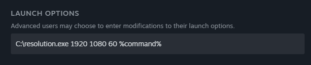

# resolution.exe

Tiny application made in C for Windows. It allows to force a game resolution by changing the desktop resolution before running the game.

Useful for:

+ Games that don't let you choose higher resolutions (Starfield, Death Stranding)
+ Games that let you choose higher resolutions but use their own scaling (Persona 5 Royal)
+ Games that don't have a refresh rate selector
+ Games that dont work with Nvidia DSR/DLDSR

## How to use
Download the release and extract resolution.exe to any folder.

`C:\resolution.exe <width> <heigth> <frequency> <game.exe>`

example

`C:\resolution.exe 1920 1080 144 Starfield.exe`

`C:\resolution.exe 3840 2160 60 Starfield.exe`

## Use in Steam games
Right-click the game. Properties > General > Launch options. `C:\resolution.exe <width> <heigth> <frequency> %command%`

